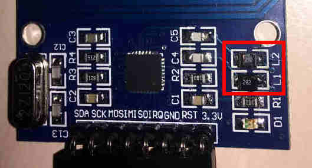
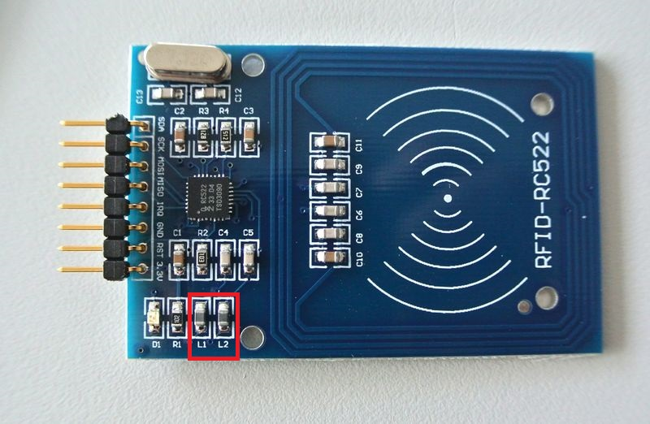

MFRC522 
===

Hacky modification to increase strength of the electromagnetic field of the MFRC522 RFID reader
---

For this hardware part of the project, you'll need:
- an MFRC522 RFID reader
- soldering iron
- solder
- desoldering equipment

Desolder/solder RFID reader
---
Just replace the two coils with one of this ones:
- https://www.conrad.de/de/p/wuerth-elektronik-we-pmi-74479887222a-induktivitaet-smd-0805-2-2-h-140-m-1-35-a-1-st-1088016.html
- https://eu.mouser.com/ProductDetail/710-74479887222C?r=710-74479887222C

If both links are down just get two coils with this values:
- Inductance (L): 2.2 µH
- Widerstand (Ω): ~110/140 mΩ

